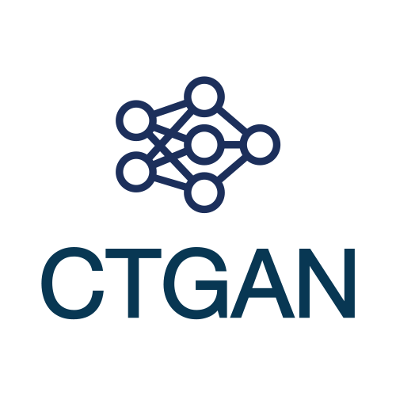

<p align="left">
  <a href="https://dai.lids.mit.edu">
    
  </a>
  <i>An Open Source Project from the <a href="https://dai.lids.mit.edu">Data to AI Lab, at MIT</a></i>
</p>

[](https://pypi.org/search/?c=Development+Status+%3A%3A+2+-+Pre-Alpha)
[](https://pypi.python.org/pypi/ctgan)
[](https://travis-ci.com/sdv-dev/CTGAN)
[](https://pepy.tech/project/ctgan)
[](https://codecov.io/gh/sdv-dev/CTGAN)




* Website: https://sdv.dev
* Documentation: https://sdv.dev/SDV
* Repository: https://github.com/sdv-dev/CTGAN
* License: [MIT](https://github.com/sdv-dev/CTGAN/blob/master/LICENSE)
* Development Status: [Pre-Alpha](https://pypi.org/search/?c=Development+Status+%3A%3A+2+-+Pre-Alpha)

## Overview

CTGAN is a collection of Deep Learning based Synthetic Data Generators for single table data, which are able to learn from real data and generate synthetic clones with high fidelity.

Currently, this library implements the **CTGAN** and **TVAE** models proposed in the [Modeling Tabular data using Conditional GAN](https://arxiv.org/abs/1907.00503) paper. For more information about these models, please check out the respective user guides:
* [CTGAN User Guide](https://sdv.dev/SDV/user_guides/single_table/ctgan.html).
* [TVAE User Guide](https://sdv.dev/SDV/user_guides/single_table/tvae.html).

# Install

## Requirements

**CTGAN** has been developed and tested on [Python 3.6, 3.7 and 3.8](https://www.python.org/downloads/)

## Install from PyPI

The recommended way to installing **CTGAN** is using [pip](https://pip.pypa.io/en/stable/):

```bash
pip install ctgan
```

This will pull and install the latest stable release from [PyPI](https://pypi.org/).

## Install with conda

**CTGAN** can also be installed using [conda](https://docs.conda.io/en/latest/):

```bash
conda install -c sdv-dev -c pytorch -c conda-forge ctgan
```

This will pull and install the latest stable release from [Anaconda](https://anaconda.org/).


# Usage Example

> :warning: **WARNING**: If you're just getting started with synthetic data, we recommend using the SDV library which provides user-friendly APIs for interacting with CTGAN. To learn more about using CTGAN through SDV, check out the user guide [here](https://sdv.dev/SDV/user_guides/single_table/ctgan.html).

To get started with CTGAN, you should prepare your data as either a `numpy.ndarray` or a `pandas.DataFrame` object with two types of columns:

* **Continuous Columns**: can contain any numerical value.
* **Discrete Columns**: contain a finite number values, whether these are string values or not.

In this example we load the [Adult Census Dataset](https://archive.ics.uci.edu/ml/datasets/adult) which is a built-in demo dataset. We then model it using the **CTGANSynthesizer** and generate a synthetic copy of it.


```python3
from ctgan import CTGANSynthesizer
from ctgan import load_demo

data = load_demo()

# Names of the columns that are discrete
discrete_columns = [
    'workclass',
    'education',
    'marital-status',
    'occupation',
    'relationship',
    'race',
    'sex',
    'native-country',
    'income'
]

ctgan = CTGANSynthesizer(epochs=10)
ctgan.fit(data, discrete_columns)

# Synthetic copy
samples = ctgan.sample(1000)
```


# Join our community


1. Please have a look at the [Contributing Guide](https://sdv.dev/SDV/developer_guides/contributing.html) to see how you can contribute to the project.
2. If you have any doubts, feature requests or detect an error, please [open an issue on github](https://github.com/sdv-dev/CTGAN/issues) or [join our Slack Workspace](https://sdv-space.slack.com/join/shared_invite/zt-gdsfcb5w-0QQpFMVoyB2Yd6SRiMplcw#/).
3. Also, do not forget to check the [project documentation site](https://sdv.dev/SDV/)!


# Citing TGAN

If you use CTGAN, please cite the following work:

- *Lei Xu, Maria Skoularidou, Alfredo Cuesta-Infante, Kalyan Veeramachaneni.* **Modeling Tabular data using Conditional GAN**. NeurIPS, 2019.

```LaTeX
@inproceedings{xu2019modeling,
  title={Modeling Tabular data using Conditional GAN},
  author={Xu, Lei and Skoularidou, Maria and Cuesta-Infante, Alfredo and Veeramachaneni, Kalyan},
  booktitle={Advances in Neural Information Processing Systems},
  year={2019}
}
```

# Related Projects
Please note that these libraries are external contributions and are not maintained nor supervised by
the MIT DAI-Lab team.

## R interface for CTGAN

A wrapper around **CTGAN** has been implemented by Kevin Kuo @kevinykuo, bringing the functionalities
of **CTGAN** to **R** users.

More details can be found in the corresponding repository: https://github.com/kasaai/ctgan

## CTGAN Server CLI

A package to easily deploy **CTGAN** onto a remote server. This package is developed by Timothy Pillow @oregonpillow.

More details can be found in the corresponding repository: https://github.com/oregonpillow/ctgan-server-cli


# The Synthetic Data Vault

<p>
  <a href="https://sdv.dev">
    
  </a>
  <p><i>This repository is part of <a href="https://sdv.dev">The Synthetic Data Vault Project</a></i></p>
</p>

* Website: https://sdv.dev
* Documentation: https://sdv.dev/SDV